<table>
<tr>
<td valign="top"></td>
<td valign="top"></td>
</tr>
</table>

## ZAKI NOORANI

**Product-Focused Web & AI Engineer · Turning Ideas into Production-Ready Solutions**

 

<!-- animated contribution graph, refreshed daily by the workflow -->

